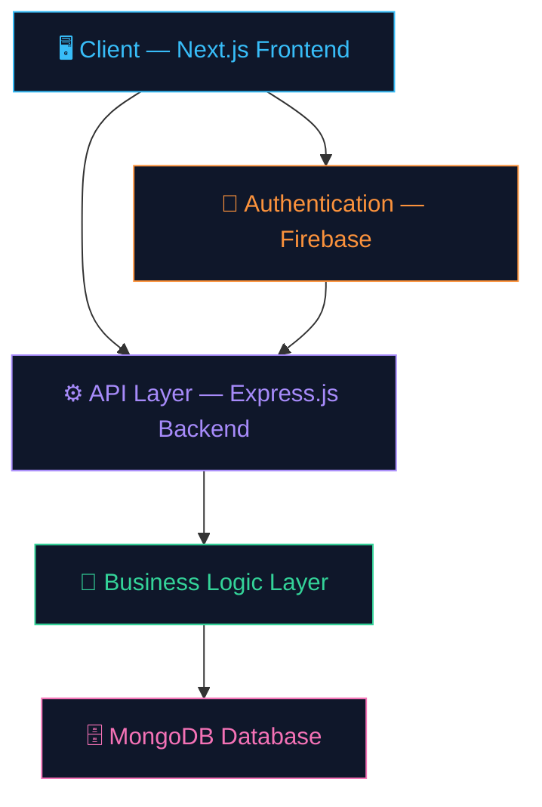

<div align="center">

<!-- Animated Banner -->


<!-- Badges Row 1 -->
<p align="center">
  
  
  
  
  
</p>

<!-- Badges Row 2 -->
<p align="center">
  
  
  
  
</p>

<!-- Status Badges -->
<p align="center">
  
  
  
  
</p>

<br/>

> ### 🧭 *"Measure. Understand. Improve. Get Placed."*
> A full-stack career intelligence platform that helps students analyze skills, track placement readiness, and grow systematically using AI-driven insights.

<br/>

</div>

---

## 📌 Table of Contents

<details>
<summary><b>Click to expand</b></summary>

- [🌟 Vision](#-vision)
- [✨ Key Features](#-key-features)
- [🧩 System Architecture](#-system-architecture)
- [🧠 Skill Evaluation Model](#-skill-evaluation-model)
- [🛠 Tech Stack](#-tech-stack)
- [📊 Platform Modules](#-platform-modules)
- [👨‍💼 Multi-Role System](#-multi-role-system)
- [🔐 Security Architecture](#-security-architecture)
- [📂 Project Structure](#-project-structure)
- [⚙️ Installation](#-installation)
- [🌍 Deployment](#-deployment)
- [🚀 Future Enhancements](#-future-enhancements)
- [👨‍💻 Author](#-author)

</details>

---

## 🌟 Vision

<div align="center">
<table>
<tr>
<td align="center" width="33%">
<br/>
<b>AI-Powered Insights</b><br/>
<sub>Smart career recommendations tailored to each student</sub>
</td>
<td align="center" width="33%">
<br/>
<b>Data-Driven Analytics</b><br/>
<sub>Visual skill breakdowns and readiness scoring</sub>
</td>
<td align="center" width="33%">
<br/>
<b>Placement Focused</b><br/>
<sub>Structured guidance toward real placement success</sub>
</td>
</tr>
</table>
</div>

CareerCompass is built to help students **measure, understand, and improve** their placement readiness using intelligent analytics and structured career guidance — all in one platform.

---

## ✨ Key Features

<div align="center">

| Feature | Description |
|:---|:---|
| 📊 **Career Readiness Score** | Composite score based on DSA, CS fundamentals, projects & resume |
| 📈 **Skill Visualization Dashboard** | Radar charts, bar charts, and performance comparison graphs |
| 🧠 **Intelligent Gap Analysis** | Highlights exactly what to study and which skills need improvement |
| 🎯 **Personalized Improvement Path** | Step-by-step guidance tailored to each student's profile |
| 🧪 **Technical Test System** | In-platform tests to assess and track skill growth |
| 👥 **Multi-Role Platform** | Separate dashboards for Students, Mentors, TPO & Admin |
| 🔐 **Secure Auth System** | Firebase ID token + JWT with role-based access control |

</div>

---

## 🧩 System Architecture



---

## 🧠 Skill Evaluation Model

CareerCompass calculates a **holistic Placement Readiness Score** using four core pillars:

```
┌─────────────────────────────────────────────────────────────┐
│              🎯  PLACEMENT READINESS SCORE                  │
├──────────────────┬──────────────────┬───────────────────────┤
│  📐 DSA Skills   │  🖥️ Core CS      │  🗂️ Projects          │
│  Algorithms &    │  OS, DBMS,       │  Complexity,          │
│  Data Structures │  Networks, OOP   │  Stack, Impact        │
├──────────────────┴──────────────────┴───────────────────────┤
│                    📄 Resume Quality                        │
│           Formatting · Keywords · Completeness              │
└─────────────────────────────────────────────────────────────┘
```

Each component contributes a weighted score toward the **overall readiness percentage** shown on the dashboard.

---

## 🛠 Tech Stack

<div align="center">

### 🖥️ Frontend


### ⚙️ Backend


### 🗄️ Database & Auth


### 🔧 Dev Tools


</div>

---

## 📊 Platform Modules

<details>
<summary><b>🎓 Student Dashboard</b></summary>

- 📊 Real-time skill analytics with visual charts
- 🎯 Placement readiness score with breakdown
- 📝 Personalized improvement suggestions
- 📈 Performance tracking over time

</details>

<details>
<summary><b>🧪 Test System</b></summary>

- ✅ Attempt technical assessments in-platform
- 📉 Post-test performance analysis
- 📊 Skill growth tracking across attempts
- 🔁 Retry tests to monitor improvement

</details>

<details>
<summary><b>👨‍🏫 Mentor Dashboard</b></summary>

- 👀 Review assigned student progress
- 🎯 Identify individual skill gaps
- 💬 Provide structured guidance and feedback
- 📊 Cohort-level analytics

</details>

<details>
<summary><b>🛡️ Admin Panel</b></summary>

- 👥 User management (create, suspend, delete)
- ✅ Approve Mentor / TPO role requests
- 🔧 Control platform-wide operations
- 📊 Platform usage analytics

</details>

---

## 👨‍💼 Multi-Role System

<div align="center">

```
╔══════════════╦═══════════════════════════════════════════════════════╗
║    Role      ║  Capabilities                                         ║
╠══════════════╬═══════════════════════════════════════════════════════╣
║ 🎓 Student   ║  Track skills · Attempt tests · View insights        ║
║ 👨‍🏫 Mentor   ║  Guide students · Analyze performance                ║
║ 🏢 TPO       ║  Monitor placement readiness · Batch analytics       ║
║ 🛡️ Admin     ║  Manage users · Approve roles · Platform control     ║
╚══════════════╩═══════════════════════════════════════════════════════╝
```

</div>

---

## 🔐 Security Architecture

```
🔒 Security Layers
├── 🔑 Firebase ID Token Verification    (Identity Layer)
├── 🪙 JWT Session Tokens               (Session Layer)
├── 🛡️ Role-Based Access Control (RBAC) (Authorization Layer)
└── 🚧 Protected API Routes             (Route Guard Layer)
```

---

## 📂 Project Structure

```
career-compass/
│
├── 📁 client/                   # Next.js Frontend
│   ├── 📁 app/                  # App router pages
│   ├── 📁 components/           # Reusable UI components
│   ├── 📁 hooks/                # Custom React hooks
│   └── 📁 lib/                  # Utilities & helpers
│
└── 📁 server/                   # Express.js Backend
    ├── 📁 controllers/          # Route handler logic
    ├── 📁 models/               # Mongoose data models
    ├── 📁 routes/               # API route definitions
    ├── 📁 middleware/           # Auth & validation middleware
    └── 📁 config/               # Environment configuration
```

---

## ⚙️ Installation

### Prerequisites
- Node.js `v18+`
- MongoDB (local or Atlas)
- Firebase project configured

### 1️⃣ Clone the Repository

```bash
git clone https://github.com/yourusername/career-compass.git
cd career-compass
```

### 2️⃣ Install Dependencies

```bash
# Frontend
cd client
npm install

# Backend
cd ../server
npm install
```

### 3️⃣ Configure Environment Variables

```bash
# server/.env
MONGODB_URI=your_mongodb_connection_string
JWT_SECRET=your_jwt_secret
FIREBASE_PROJECT_ID=your_firebase_project_id

# client/.env.local
NEXT_PUBLIC_FIREBASE_API_KEY=your_firebase_api_key
NEXT_PUBLIC_API_URL=http://localhost:5000
```

### 4️⃣ Run the Application

```bash
# Start Backend (from /server)
npm run dev

# Start Frontend (from /client)
npm run dev
```

Open [http://localhost:3000](http://localhost:3000) in your browser 🚀

---

## 🌍 Deployment

<div align="center">

| Layer | Platform | Status |
|:---:|:---:|:---:|
| 🖥️ Frontend | **Vercel** |  |
| ⚙️ Backend | **Render** |  |
| 🗄️ Database | **MongoDB Atlas** |  |

</div>

---

## 🚀 Future Enhancements

```
🔮 Coming Soon
│
├── 🤖 AI-Powered Career Path Recommendations
├── 📄 Resume AI Analysis & Feedback Engine
├── 💻 Integrated Coding Practice Module
├── 🎤 AI Interview Simulation
└── 📚 Personalized Interview Preparation Roadmaps
```

---

## 👨‍💻 Author

<div align="center">


### **Kannu**
*B.Tech Computer Science (AI)*

[](https://github.com/yourusername)
[](https://linkedin.com/in/yourusername)
[](https://yourportfolio.com)

> *Full Stack Developer · AI Enthusiast · Building tools that help students succeed*

</div>

---

## ⭐ Support the Project

<div align="center">

If **CareerCompass** helped you or you found it interesting:

[](https://github.com/yourusername/career-compass)
[](https://github.com/yourusername/career-compass/fork)
[](https://twitter.com/intent/tweet?text=Check%20out%20CareerCompass%20-%20an%20AI-powered%20career%20placement%20platform!&url=https://github.com/yourusername/career-compass)

</div>

---

<div align="center">

### 💡 Project Mission

> *CareerCompass aims to become the most comprehensive career intelligence system —*
> *helping students **prepare smarter**, **improve faster**, and **succeed** in technical careers.*


**Made with ❤️ by Kannu**

</div>
